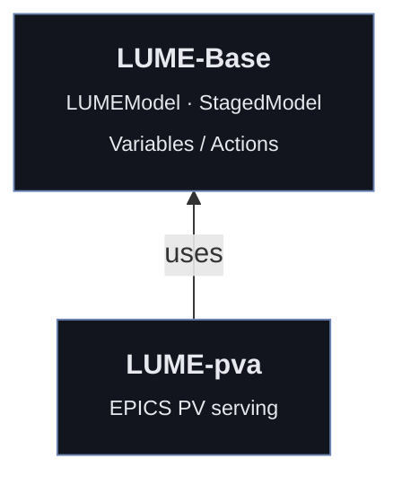
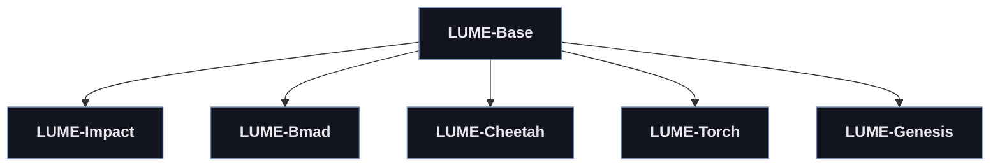
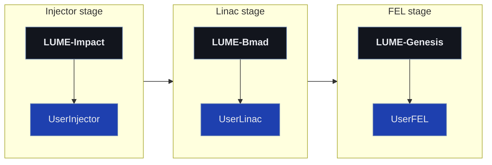

LUME is organized in three tiers.
A simulator-agnostic base package defines the common base and model interface, which is consumed by other parts of the ecosystem such as LUME-pva for EPICS PV serving.
Simulator-specific packages wrap individual codes in a convenient Python layer and adapt them to the LUME interface.
Facility-specific packages are developed by users and can integrate multiple codes into staged pipelines that represent real machines.

## Interface Level

[LUME-Base](https://github.com/lume-science/lume-base) defines the core abstractions shared by every package.
It contains the standard dict-like method of interacting with simulation tools.
The `LUMEModel` interface provides a standard way to expose what users may interact with and how to interact with them in physics simulations with state (through `Variable` objects).
These can be chained using a `StagedModel`.
LUME-pva builds on the `LUMEModel` interface to serve model variables as EPICS PVs.

## Simulation Codes Level

Each physics simulation tool gets a Python wrapper package (LUME-Impact, LUME-Bmad, LUME-Cheetah, LUME-Torch, and the in-development LUME-Genesis).
These packages define a Python interface for interacting with the codes and also include "batteries-included" `LUMEModel` objects specialized to each code.
These help by automatically generating variables, which can then be extended with custom actions as required, from pre-loaded simulations of user lattices.

## User Implementation Level

Real machines are modeled by composing the simulator-specific wrapper classes into a `StagedModel`.
Each stage subclasses objects from the LUME package shown above it, and the stages are chained left to right: a `UserInjector` stage (Impact) feeds a `UserLinac` stage (Bmad), which feeds a `UserFEL` stage (Genesis), forming a `UserFacilityModel` that simulates the machine end to end.
Through the `LUMEModel` interface, this chained simulation can be connected to packages like `LUME-pva`, e.g., for controlling the model through EPICS PVs.
