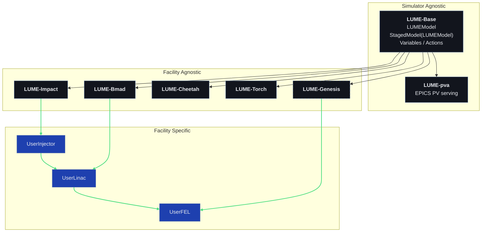

LUME is organized in three tiers. A simulator-agnostic base package defines
the common model interface, simulator-specific packages adapt individual
codes to that interface, and facility-specific packages compose those models
into staged pipelines for real machines.

## The tiers

**Simulator agnostic.** [LUME-Base](https://github.com/lume-science/lume-base)
defines the core abstractions shared by every package: `LUMEModel`, the
`StagedModel` composition of models, and the variable/action interface.
LUME-pva builds on it to serve model variables as EPICS PVs.

**Facility agnostic.** Each simulation code gets a thin adapter package
(LUME-Impact, LUME-Bmad, LUME-Cheetah, LUME-Torch, and the in-development
LUME-Genesis) whose model class subclasses `LumeModel`. These packages know
about their simulator but nothing about any particular machine.

**Facility specific.** Real machines are modeled by composing the adapters
into a `StagedModel`. For example, a facility might chain a `UserInjector`
stage (Impact), a `UserLinac` stage (Bmad), and a `UserFEL` stage (Genesis)
into a `UserFacilityModel` that simulates the machine end to end.
